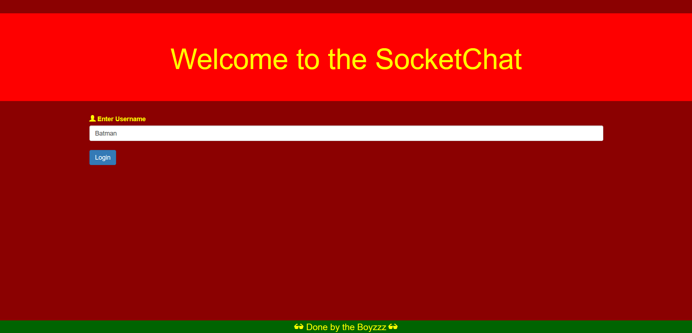
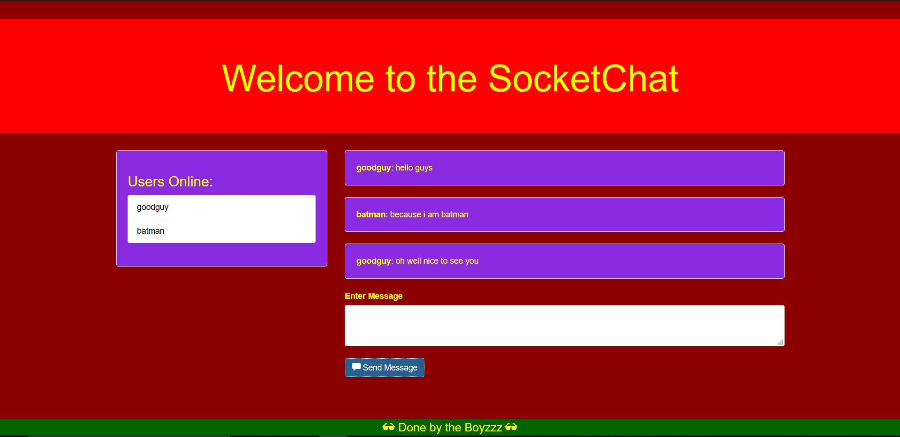

<p align="center">
  <a href="" rel="noopener">
 </a>
</p>

<h2 align="center">Socket Chat</h2>

<div align="center">

  []()
  [](https://github.com/vijethph/SocketChat/issues)
  [](https://github.com/vijethph/SocketChat/network)
  [](https://github.com/vijethph/SocketChat/stargazers)
  [](https://github.com/vijethph/SocketChat/pulls)
  [](https://github.com/vijethph/SocketChat/blob/master/LICENSE)
  [](https://hub.docker.com/r/vijethph/socketchat)
</div>

---

<p align="center"> A SocketIO based online chat application which can be deployed to Localtunnel
    <br> Made with HTML, CSS and Javascript
</p>

## 📝 Table of Contents
- [Screenshots](#screenshots)
- [About](#about)
- [Getting Started](#getting_started)
- [Deployment](#deployment)
- [Usage](#usage)
- [Built Using](#built_using)
- [Authors](#authors)
- [Acknowledgments](#acknowledgement)

## Screenshots <a name="screenshots"></a>



## 🧐 About <a name = "about"></a>
This is a javascript program that can be used to connect online with friends by hosting one server at any particular point. It uses Express and SocketIO frameworks to establish and maintain the connection.

Users can simply join into the chat and put up messages which can be read by others.

## 🏁 Getting Started <a name = "getting_started"></a>
Follow these instructions in order to get a copy of the project up and running on your local machine for development and testing purposes. See [deployment](#deployment) for notes on how to deploy the project on as a live server.

### Prerequisites
node.js>=10 and npm>=2.25 are required.

After installing, check their versions using these commands

```
node -v
npm -v
```

### 🧱 Installing <a name="installing"></a>
Clone this project and open this project in terminal.

Install Dependencies:  Express and SocketIO

```
npm install
```

And run the project using following command and check the output at http://localhost:3000 in your browser.

```
npm start
```

The following output will be shown in the terminal after running above command.

```
listening on *:3000
```

Another way to install this app is to use it's Docker Image, which is available at [DockerHub](https://hub.docker.com/r/vijethph/socketchat). Just run these commands to pull the image and start the container:
```
docker pull vijethph/socketchat
docker run -p 3000:3000 vijethph/socketchat
```
This will run the app at http://localhost:3000, which can be checked in your browser.

<!--## 🔧 Running the tests <a name = "tests"></a>
Explain how to run the automated tests for this system.

### Break down into end to end tests
Explain what these tests test and why

```
Give an example
```

### And coding style tests
Explain what these tests test and why

```
Give an example
```
-->

## 🎈 Usage <a name="usage"></a>
This application can be used by others if it is deployed using the steps in [deployment](#deployment). For usage by a single user, the above [installation](#installing) steps are sufficient.

## 🚀 Deployment <a name = "deployment"></a>
After starting the server, open another terminal, connect to the internet and type the following

```
npm install -g localtunnel
lt --port 3000
```
Now the project is deployed. It will show an output giving a website address like this:
```
deployed at xyz@site.com
```
Ask your friends to open up the specified url and start chatting.

## ⛏️ Built Using <a name = "built_using"></a>
- [Express](https://expressjs.com/) - Server Framework
- [SocketIO](https://socketio.com/) - Connection Framework
- [NodeJS](https://nodejs.org/en/) - Server Environment

## ✍️ Authors <a name = "authors"></a>
- [@vijethph](https://github.com/vijeth) - Idea & Full Development

See also the list of [contributors](https://github.com/vijethph/) who participated in this project.

## 🎉 Acknowledgements <a name = "acknowledgement"></a>
- Thanks to CPMA Session conducted by ATS Learning Solutions
- Inspiration: Project Ideas for Javascript
- References: All Youtube Channels for using SocketIO.
- [Brad Traversy](https://github.com/bradtraversy)


### Made with ❤ in India
