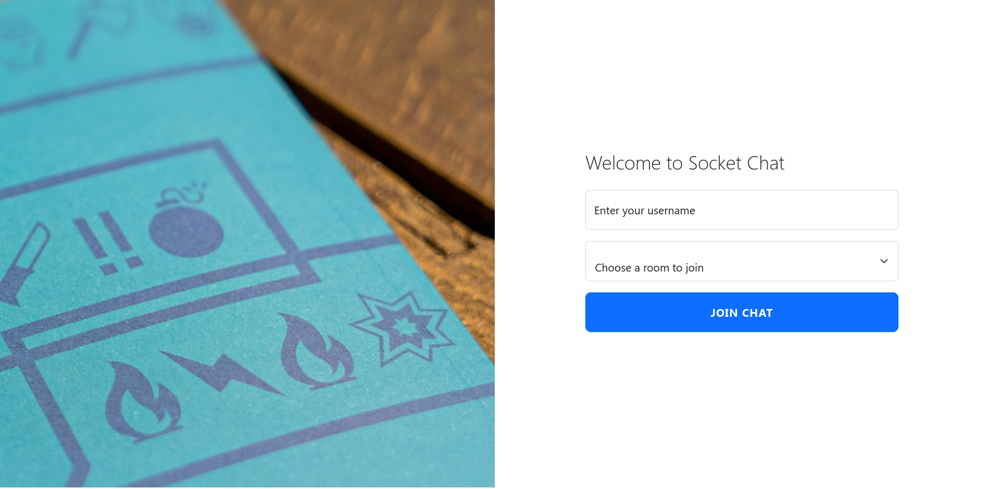
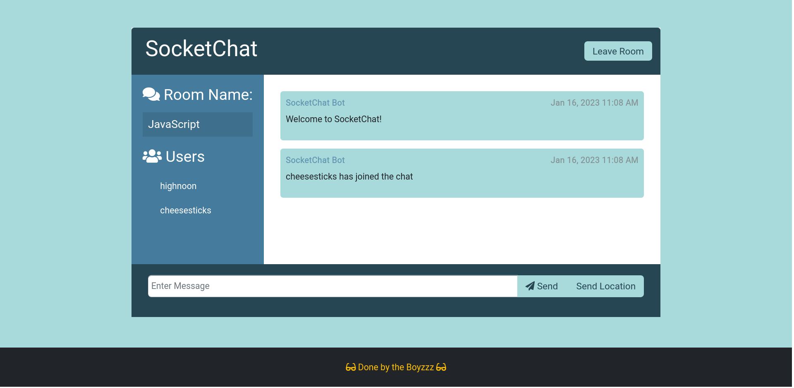
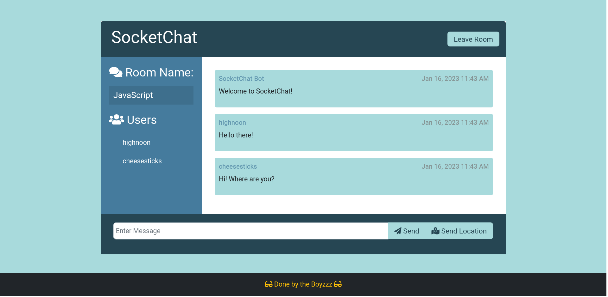
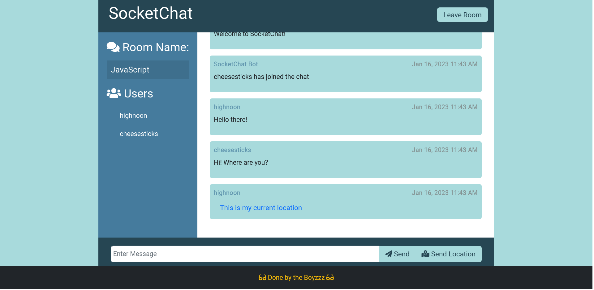
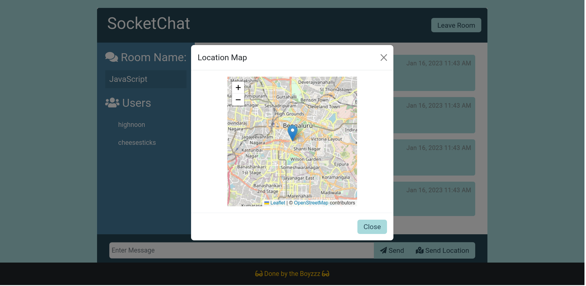

<p align="center">
 </a>
</p>

<h2 align="center">Socket Chat</h2>

<div align="center">

  []()
  [](https://github.com/vijethph/SocketChat/issues)
  [](https://github.com/vijethph/SocketChat/network)
  [](https://github.com/vijethph/SocketChat/stargazers)
  [](https://github.com/vijethph/SocketChat/pulls)
  [](https://github.com/vijethph/SocketChat/blob/master/LICENSE)
  [](https://hub.docker.com/r/vijethph/socketchat)
  [](https://render.com/deploy?repo=https://github.com/vijethph/SocketChat)
  [](https://www.typescriptlang.org/)
</div>

---

<p align="center"> A SocketIO based online chat application which can be deployed and run via Docker and Localtunnel
    <br> Made with TypeScript, ExpressJS, ioredis and Bootstrap
</p>

## 📋 Table of Contents
- [Screenshots](#screenshots)
- [About](#about)
- [Getting Started](#getting_started)
- [Deployment](#deployment)
- [Usage](#usage)
- [Built Using](#built_using)
- [Authors](#authors)
- [Acknowledgments](#acknowledgement)

## 📸 Screenshots <a name="screenshots"></a>
|    Login Page   |    New User Entry     |  Chat Screen   |           
| :---------: | :-----------: | :-----------: |      
|  |  |  |     
| Login Page | Notification to existing users on new user join | Chat Screen in a room |            

|    Sending Location   |    Location Details     |             
| :---------: | :-----------: |    
|  |  |    
| Location Details sent as a modal link | Location Map displayed in a modal |       


## ℹ️ About <a name = "about"></a>
This is a chat application that can be used to connect online with friends by hosting one server at any particular point. It uses Express and SocketIO frameworks to establish and maintain the connection, and Redis to broadcast events to a subset of clients (users in a room).

Users can pick a room and join the chat and send messages which can be read by others. They can also send their location co-ordinates to others, which is displayed in a map under a modal.

## ⚙️ Getting Started <a name = "getting_started"></a>
Follow these instructions in order to get a copy of the project up and running on your local machine for development and testing purposes. See [deployment](#deployment) for notes on how to deploy the project on as a live server.

### 💾 Prerequisites
node.js>=16 and npm>=7 are required.

After installing, check their versions using these commands

```
node -v
npm -v
```

### 💻 Installing <a name="installing"></a>
Clone this project and open this project in terminal.

Install Dependencies.

```bash
npm install
```

Pull Redis image from DockerHub and run it in background.   

```bash
docker pull redis:6.2
docker run --name redis-cache -p 6379:6379 -d redis:6.2
```

Create a `.env` file in the project folder and add the following entry:

```env
REDIS_URL="redis://localhost:6379"
```

Finally, run the project using following command and check the output at http://localhost:3000 in your browser.

```bash
npm start
```

The following output will be shown in the terminal after running above command.

```bash
listening on PORT:3000
```

Another way to install this app is to use Docker Compose. Run this command to start the app:
```
docker-compose up
```
This will run the app at http://localhost:3000, which can be seen in your browser.

<!--## 🔧 Running the tests <a name = "tests"></a>
Explain how to run the automated tests for this system.

### Break down into end to end tests
Explain what these tests test and why

```
Give an example
```

### And coding style tests
Explain what these tests test and why

```
Give an example
```
-->

## 🌐 Usage <a name="usage"></a>
This application can be used by others if it is deployed using the steps in [deployment](#deployment). For usage by a single user, the above [installation](#installing) steps are sufficient.

## 🚀 Deployment <a name = "deployment"></a>
After starting the server, open another terminal, connect to the internet and type the following

```
npm install -g localtunnel
lt --port 3000
```
Now the project is deployed. It will show an output giving a website address like this:
```
deployed at xyz@site.com
```
Ask your friends to open up the specified url and start chatting.

## ⛏️ Built Using <a name = "built_using"></a>
- [Express](https://expressjs.com/) - Server Framework
- [SocketIO](https://socketio.com/) - Connection Framework
- [NodeJS](https://nodejs.org/en/) - Server Environment
- [TypeScript](https://www.typescriptlang.org/) - Programming Language
- [Redis](https://redis.io/) - Messaging Cache
- [Docker](https://docs.docker.com/get-started/overview/) - Build Framework

## ✍️ Authors <a name = "authors"></a>
- [@vijethph](https://github.com/vijeth) - Idea & Development

## 🎉 Acknowledgements <a name = "acknowledgement"></a>
- Thanks to CPMA Session conducted by ATS Learning Solutions
- Inspiration: Project Ideas for Javascript
- References: All Youtube Channels for using SocketIO.
- [Brad Traversy](https://github.com/bradtraversy)

